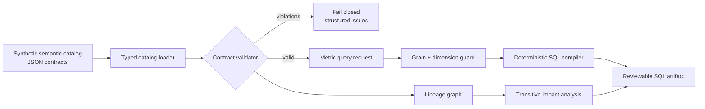

# Semantic Metrics Governance — Synthetic Reference Implementation

> **Portfolio demo — synthetic definitions only.** This repository is not a
> production semantic layer, has not governed a real business metric catalog,
> and does not connect to a warehouse. The included commerce model is fictional.

A dependency-free semantic contract validator, deterministic SQL compiler, and
lineage/impact engine. The project focuses on a deceptively difficult data
engineering problem: ensuring that one metric name means the same calculation,
at an explicit grain, across every permitted slice.

## What it demonstrates

- governed model, dimension, measure, metric, owner, and certification contracts;
- primary-grain and entity validation;
- cross-reference checks between metrics, measures, dimensions, and time grains;
- fail-closed dimension access—query callers cannot request undeclared slices;
- simple and ratio metrics with division-by-zero protection;
- deterministic SQL for auditable code review and snapshot testing;
- expression and relation allow-listing at the compiler boundary;
- lineage graphs and transitive downstream impact analysis;
- synthetic provenance enforced as a validation rule.

## Architecture



The implementation is intentionally framework-free so the semantic decisions are
visible in code. It does not claim to replace dbt Semantic Layer, Cube, Looker,
MetricFlow, or a warehouse query engine.

## Quick start

Python 3.11 or newer is required. Runtime dependencies: none.

```bash
make check
make demo
```

Validate the catalog:

```bash
PYTHONPATH=src python -m semantic_metrics \
  --catalog examples/catalog.json validate
```

Compile a governed metric request:

```bash
PYTHONPATH=src python -m semantic_metrics \
  --catalog examples/catalog.json compile \
  --metric average_order_value \
  --dimension country \
  --grain week \
  --start 2026-01-01 \
  --end 2026-03-01
```

The ratio expression is compiled deterministically:

```sql
(1.0 * SUM(order_amount)) / NULLIF(COUNT(DISTINCT order_id), 0)
```

Render lineage or ask what would be affected by a measure change:

```bash
PYTHONPATH=src python -m semantic_metrics \
  --catalog examples/catalog.json lineage --format mermaid

PYTHONPATH=src python -m semantic_metrics \
  --catalog examples/catalog.json impact \
  --node measure.orders.gross_revenue_amount
```

Container validation:

```bash
docker build -t semantic-metrics-demo .
docker run --rm semantic-metrics-demo
```

## Contract layers

| Layer | Examples of enforced invariants |
|---|---|
| Catalog | Named owner; `synthetic=true`; `production_deployment=false` |
| Model | Safe two/three-part relation; description; accountable owner |
| Grain | Nonempty, unique primary grain; every grain key is an entity dimension |
| Dimension | Safe identifier expression; declared scalar type |
| Measure | Supported aggregation; safe identifier expression |
| Metric | Existing model/measures; time dimension; allowed dimensions/grains |
| Query | Known metric; permitted grain; unique, permitted dimensions; valid date range |

Catalog validation reports all discoverable violations in one pass. Compilation
then calls the same validator and refuses to proceed if any contract is invalid.

## Metric behavior

The synthetic catalog defines:

- `gross_revenue`: sum of fictional order value;
- `order_count`: distinct fictional orders;
- `average_order_value`: gross revenue divided by distinct orders.

The example explicitly describes gross revenue as pre-refund and pre-discount.
That boundary is part of the contract: changing it is a semantic change, not an
implementation refactor.

Only `country` and `channel` are approved slicing dimensions. `customer_id`
exists on the model but is intentionally unavailable for metric queries, avoiding
an accidental high-cardinality or privacy-sensitive group-by.

## Determinism and safety boundary

For the same validated catalog and `QueryRequest`, SQL output is identical:

- dictionary iteration is sorted where it affects lineage;
- requested dimension order is explicit and preserved;
- dates are parsed as `date` values before interpolation;
- relation and field expressions are restricted to identifier patterns;
- metric aliases come only from validated identifiers.

This is defense in depth for the demo compiler, not a general SQL parser. A
production implementation should use an AST-based dialect adapter and bound
parameters where the target engine permits them.

## Repository map

```text
.
├── examples/catalog.json
├── src/semantic_metrics/
│   ├── catalog.py
│   ├── validator.py
│   ├── compiler.py
│   ├── lineage.py
│   └── cli.py
├── tests/
├── docs/
│   ├── RUNBOOK.md
│   └── adr/0001-contract-first-semantic-compilation.md
├── .github/workflows/ci.yml
├── Dockerfile
└── Makefile
```

## Test strategy

`make check` compiles the package and runs unit plus CLI tests without a database.
The suite covers valid and invalid grain, ownership, dimensions, measures,
certification, provenance, unsafe expressions, date windows, deterministic SQL,
ratio semantics, lineage traversal, Mermaid output, and CLI responses.

GitHub Actions runs the suite on Python 3.11 and 3.12, compiles a representative
ratio query, and smoke-tests the container.

## Productionization path

| Demo capability | Production addition |
|---|---|
| JSON files | Registry/API, schema versioning, approvals, audit history |
| Identifier expressions | SQL AST and dialect adapters |
| Single-model metrics | Typed joins with cardinality and fanout validation |
| CLI query | Authenticated query service with quotas and caching |
| Local lineage | Column-level warehouse/orchestrator lineage integration |
| Static certification | Steward workflow, tests, deprecation and migration policy |
| SQL output only | Warehouse execution, cost controls, cancellation, telemetry |

Before production use, add row/column security, privacy review, access policy
propagation, engine conformance tests, slowly changing dimension semantics,
timezone/fiscal calendar rules, currency conversion contracts, and result
reconciliation against approved reference datasets.

## Honest limitations

- The demo compiles SQL but never executes it.
- It supports one model per metric and therefore avoids—not solves—join fanout.
- SQL targets an ANSI-like warehouse subset and has no dialect adapter.
- Only day, week, and month calendar grains are implemented.
- Currency conversion, refunds, fiscal calendars, and SCD joins are out of scope.
- All catalog names and commerce definitions are synthetic.

See [ADR 0001](docs/adr/0001-contract-first-semantic-compilation.md) for the
tradeoffs and [RUNBOOK.md](docs/RUNBOOK.md) for a governed change workflow.

